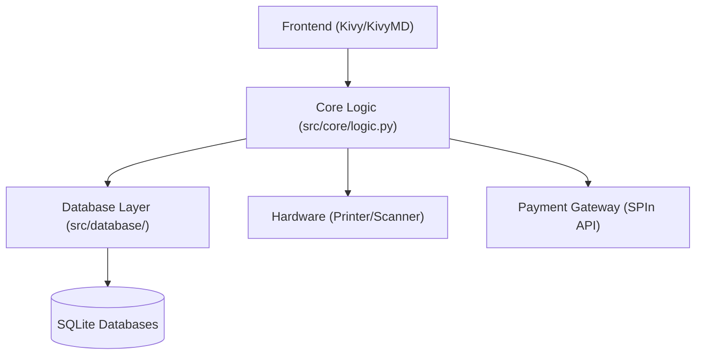

# 🛒 Retail Point of Sale (POS) System

A robust, modular, and professional Point of Sale (POS) system built with Python. Designed for retail environments, this system integrates real-time inventory tracking, secure payment processing, and comprehensive reporting into a streamlined Kivy-based interface.

## 🌟 Overview

This POS solution provides small to medium-sized retail businesses with a reliable tool to manage daily operations. It features a touch-friendly UI, supports thermal printing for receipts, and integrates with the SPIn payment gateway for modern payment processing (including Credit and EBT transactions).

### Core Value Proposition
- **Seamless Transactions:** Fast and intuitive retail checkout flow.
- **Inventory Control:** Real-time stock tracking with automatic updates.
- **Actionable Insights:** Detailed reports for shifts, departments, and specific products.
- **Hardware Integration:** Native support for USB thermal printers and cash drawers.

---

## 🛠️ Technologies Used

- **Language:** Python 3.x
- **UI Framework:** [Kivy](https://kivy.org/) & [KivyMD](https://kivymd.readthedocs.io/) (Material Design components)
- **Database:** SQLite3 (Local persistence)
- **Data Analysis:** Pandas (Reporting and data exports)
- **Thermal Printing:** `python-escpos`
- **Payment Gateway:** SPIn API (REST-based integration)
- **Environment:** Dedicated `src/` modular structure for high maintainability.

---

## 📐 High-Level Architecture

The system follows a modular architectural pattern, ensuring a clean separation of concerns between the presentation layer, business logic, and data persistence.



- **UI Layer:** Handles user interaction and visual state.
- **Logic Layer:** Coordinates data flow between the UI and external services (DB, Printer, Payment).
- **Persistence Layer:** Manages structured data using SQLite modules for inventory, shifts, and transactions.

---

## 📁 Project Structure

```bash
pos/
├── run.py                 # Main entry point (Initialization & Launch)
├── main.py                # App lifecycle and Screen management
├── src/
│   ├── ui/                # UI Screen components (Retail, Inventory, Reports)
│   │   ├── retailScreen.py
│   │   ├── inventoryScreen.py
│   │   └── payment_gateway.py
│   ├── database/          # Database interaction logic
│   │   ├── inventory.py
│   │   ├── shifts.py
│   │   └── transactions.py
│   ├── core/              # Business logic and shared utilities
│   │   └── logic.py
│   └── assets/            # UI Resources
│       ├── posapp.kv      # Kivy layout declarations
│       └── images/        # Graphical assets
├── data/                  # SQLite database files (.db)
├── logs/                  # Centralized application logs
└── variable.txt           # Persistent configuration state
```

---

## 🚀 Setup & Installation

### Prerequisites
- Python 3.8 or higher
- [Optional] USB Thermal Printer (compatible with ESC/POS)

### Installation
1. **Clone the repository:**
   ```bash
   git clone <repository-url>
   cd pos
   ```

2. **Install dependencies:**
   ```bash
   pip install -r requirements.txt
   ```

3. **Running the Application:**
   Start the POS system using the standard entry point:
   ```bash
   python3 run.py
   ```

---

## 💎 Core Features

- **Shift Management:** Structured shift initiation and closure with detailed End-of-Shift reports.
- **Retail Interface:** Multi-tab layout for quick item selection, barcode scanning, and manual entry.
- **Inventory Management:** Full CRUD operations for products and categories (Department, Tax, Deposit).
- **Payment Processing:** Integrated handling for Cash, Credit, and EBT transactions.
- **Data Export:** Generate Excel reports for transactions and inventory using Pandas.
- **Hardware Integration:** Automatic thermal printer connection and cash drawer triggering.

---

## 🔐 Shift Initiation Flow

The application secures operations through a mandatory **Shift Initiation** process. 
1. Upon launch, users must provide a name/identifier to start a new shift.
2. The system assigns a unique Shift ID and tracks all transactions against this session.
3. At the end of the day, an "End Shift" action generates a summary report and resets the session for the next operator.

---

## 📊 Database Schema Overview

The system utilizes three primary SQLite databases:
- **inventory.db:** Stores `items` (pricing, stock, categories) and `category` (tax/deposit structures).
- **transactions.db:** Stores finalized `transactions` (totals, payment types, raw receipts).
- **shifts.db:** Tracks `shifts` (duration, operator) and `CashOut_NoSale` events.

---

## 🧠 Design Decisions & Principles

- **Separation of Concerns:** Distinct modules for UI, Database, and Logic ensure that changes in one layer don't break others.
- **Validation Layer:** Robust input validation in the Inventory and Retail screens ensures data integrity.
- **Error Resilience:** Centralized error logging (`logs/error.log`) and automated database archiving/rotation through the `reset__()` utility.
- **Modular UI:** Kivy screens are defined independently, allowing for easy expansion and testing of individual components.

---

## 🧪 Testing

Testing is currently performed through functional verification of core workflows:
1. **Transaction Flow:** Add items to cart → Process payment → Verify receipt generation.
2. **Inventory Integrity:** Update product details → Confirm changes in the "Look-Up" screen.
3. **Database Resilience:** Triggering a "Reset" to verify archive creation and database re-initialization.

---

## 📈 Future Improvements

- [ ] Transition to a full SQL server (e.g., PostgreSQL) for multi-station synchronization.
- [ ] Enhanced user authentication and role-based permissions (Admin vs. Cashier).
- [ ] Real-time cloud backup for transaction data.
- [ ] Mobile companion app for inventory monitoring.

---

## 📄 License

This project is licensed under the MIT License.

<details>
<summary><b>Click to view License Agreement</b></summary>

```text
MIT License

Copyright (c) 2026

Permission is hereby granted, free of charge, to any person obtaining a copy
of this software and associated documentation files (the "Software"), to deal
in the Software without restriction, including without limitation the rights
to use, copy, modify, merge, publish, distribute, sublicense, and/or sell
copies of the Software, and to permit persons to whom the Software is
furnished to do so, subject to the following conditions:

The above copyright notice and this permission notice shall be included in all
copies or substantial portions of the Software.

THE SOFTWARE IS PROVIDED "AS IS", WITHOUT WARRANTY OF ANY KIND, EXPRESS OR
IMPLIED, INCLUDING BUT NOT LIMITED TO THE WARRANTIES OF MERCHANTABILITY,
FITNESS FOR A PARTICULAR PURPOSE AND NONINFRINGEMENT. IN NO EVENT SHALL THE
AUTHORS OR COPYRIGHT HOLDERS BE LIABLE FOR ANY CLAIM, DAMAGES OR OTHER
LIABILITY, WHETHER IN AN ACTION OF CONTRACT, TORT OR OTHERWISE, ARISING FROM,
OUT OF OR IN CONNECTION WITH THE SOFTWARE OR THE USE OR OTHER DEALINGS IN THE
SOFTWARE.
```

</details>
